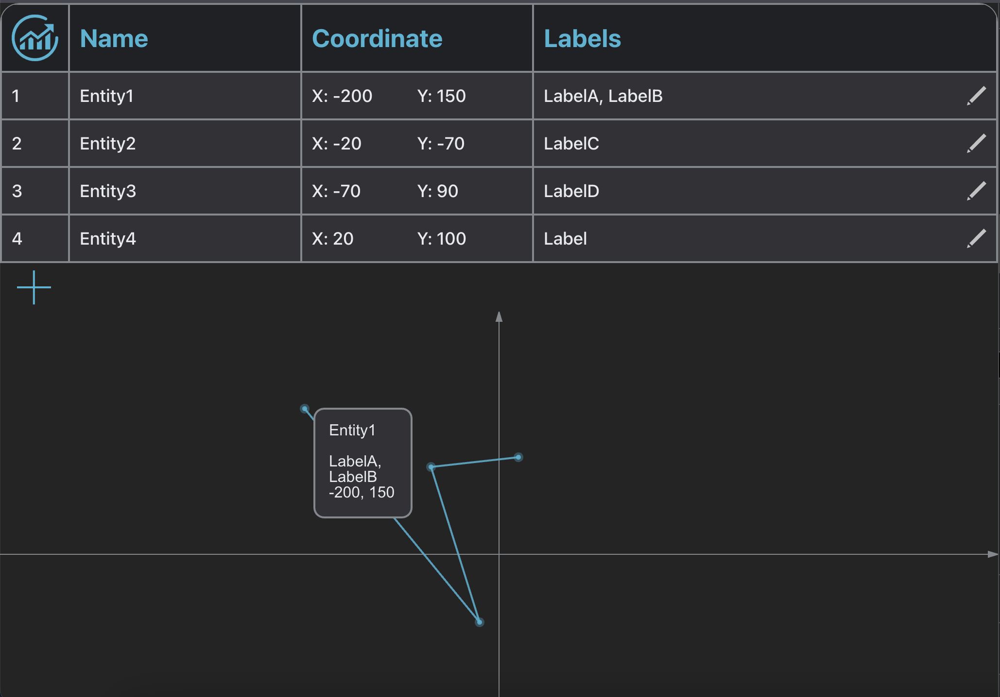

# Project "Entity Manager"

The "Entity Manager" project is a web application designed as a test assignment for frontend developers. It allows users to add, edit, and delete entities, and displays them in both a table and a graph.

## Technology Stack

The "Entity Manager" project is based on the following technologies:

- Frontend:
  - React
  - TypeScript
  - Redux
  - Konva-React

- Backend:
  - Node.js
  - Express
  - MongoDB

## Main Features

### 1. Adding Entities

Users can add new entities to the application. To do this, fill out the form and click the "Add" button. The added entity will be displayed in the table and on the graph.

### 2. Editing Entities

Users can modify existing entities. To do this, click on the entity in the table, make the necessary changes in the form, and click the "Save" button. The changes will be reflected in the table and on the graph.

### 3. Deleting Entities

Users can delete existing entities. To do this, click on the entity in the table and click the "Delete" button. The entity will be removed from the table and the graph.

### 4. Displaying a Table

Users can view all added entities in a table format. The table contains information about each entity, such as its name, description, and creation date.

### 5. Displaying a Graph

Users can visualize the entities on a graph. The graph provides a visual representation of the distribution of entities over time.

Visit the Entity manager [Link to the **GitHub Pages**](https://bababum95.github.io/entity-manager/)
